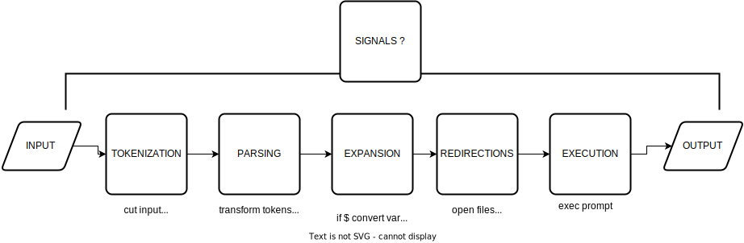
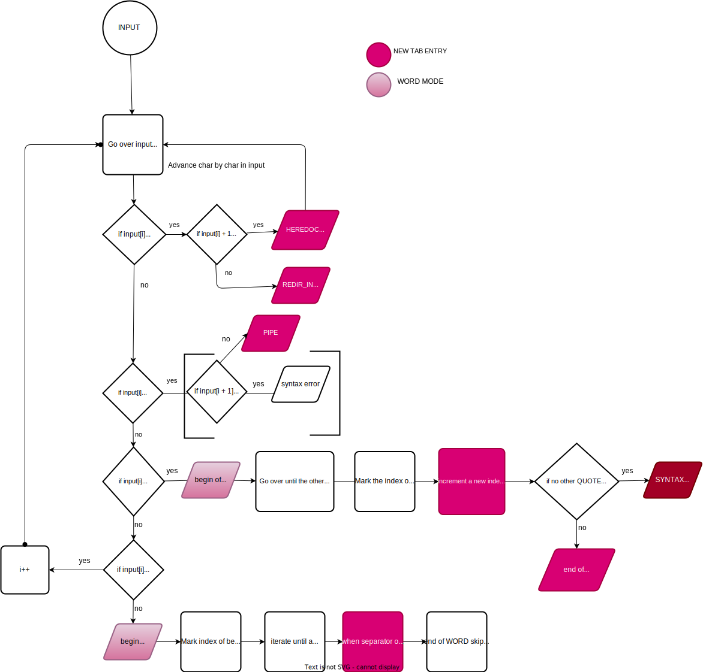

# Doc minishell

#### This is extracted from the Bash manual 

The following is a brief description of the shell’s operation when it reads and executes a command. Basically, the shell does the following:
1. Reads its input.
2. Breaks the input into words and operators, obeying the quoting rules described in [Quoting](https://www.gnu.org/software/bash/manual/bash.html#Quoting). These tokens are separated by metacharacters.
3. Parses the tokens into simple and compound commands ([Shell Commands](https://www.gnu.org/software/bash/manual/bash.html#Shell-Commands)).
4. Performs the various shell expansions ([Shell Expansions](https://www.gnu.org/software/bash/manual/bash.html#Shell-Expansions)), breaking the expanded tokens into lists of filenames ([Filename Expansion](https://www.gnu.org/software/bash/manual/bash.html#Filename-Expansion)) and commands and arguments.
5. Performs any necessary redirections ([Redirections](https://www.gnu.org/software/bash/manual/bash.html#Redirections)) and removes the redirection operators and their operands from the argument list.
6. Executes the command ([Executing Commands](https://www.gnu.org/software/bash/manual/bash.html#Executing-Commands)).
7. Optionally waits for the command to complete and collects its exit status ([Exit Status](https://www.gnu.org/software/bash/manual/bash.html#Exit-Status)).

#### Grammar
#explanations bnf : 
"<...> : nonterminal, an abstract symbol that rpz a grammatical category (such as sentence, an instruction, an expression, etc)
variable ::= a | b | c : terminal : basic symbol's language. They cannot be subdivised (such as keywords, specific char, generally written as is in the rules)
definitions (productions rules) : defines how non-terminals can be transformed into terminals or into other non-terminals. ::= is equal to -> and means "is defined as"
ex : <expression> ::= <terme> "+" <expression> | <terme> : means that expression can be defined as terme followed by an "+" and other expression or simply as a terme
| : there is differents possible definitions 
recursivity : a nonterminals can be defined by itself"

%token WORD
%token PIPE			' | '
%token QUOTE		' ' '
%token D_QUOTE		' " '
%token REDIR_IN		' < ',
%token REDIR_OUT	' > '
%token REDIR_APP	' >> '
%token REDIR_HEREDOC' <<' 

<NUMBER> ::= <DIGIT>
           | <NUMBER> <DIGIT>

<WORD> ::= <ALPHA>
         | <WORD> <ALPHA>
         | <WORD> '_'

<WORD-LIST> ::= <WORD>
             |  <WORD-LIST> <WORD>

<ASSIGNMENT-WORD> ::= <WORD> '=' <WORD>

<REDIRECTION> ::=  '>' <WORD>
                |  '<' <WORD>
                |  <NUMBER> '>' <WORD>
                |  <NUMBER> '<' <WORD>
                |  '>>' <WORD>
                |  <NUMBER> '>>' <WORD>
                |  '<<' <WORD>
                |  <NUMBER> '<<' <WORD>

<SIMPLE-COMMAND-ELEMENT> ::= <WORD>
                          |  <ASSIGNMENT-WORD>
                          |  <REDIRECTION>

<REDIRECTION-LIST> ::= <REDIRECTION>
                    |  <REDIRECTION-LIST> <REDIRECTION>

<SIMPLE-COMMAND> ::=  <SIMPLE-COMMAND-ELEMENT>
                   |  <SIMPLE-COMMAND> <SIMPLE-COMMAND-ELEMENT>

<COMMAND> ::=  <SIMPLE-COMMAND>
            |  <SHELL-COMMAND>
            |  <SHELL-COMMAND> <REDIRECTION-LIST>

<PIPELINE-COMMAND> ::= <PIPELINE> '| <PIPELINE>
					| <COMMAND>	

### 1. Tokenization 
#### The tokenization consists to cut the string returned by readline() function into token (small pieces of substring). We identified x tokens types :
#### 1. PIPE (the char '|') 
#### 2. REDIRECTIONS (> , <, >>, <<) 
#### 3. QUOTES / D_QUOTES

